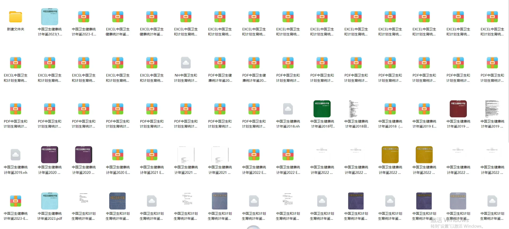
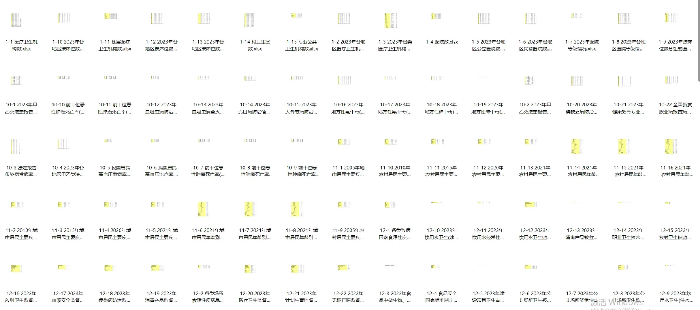
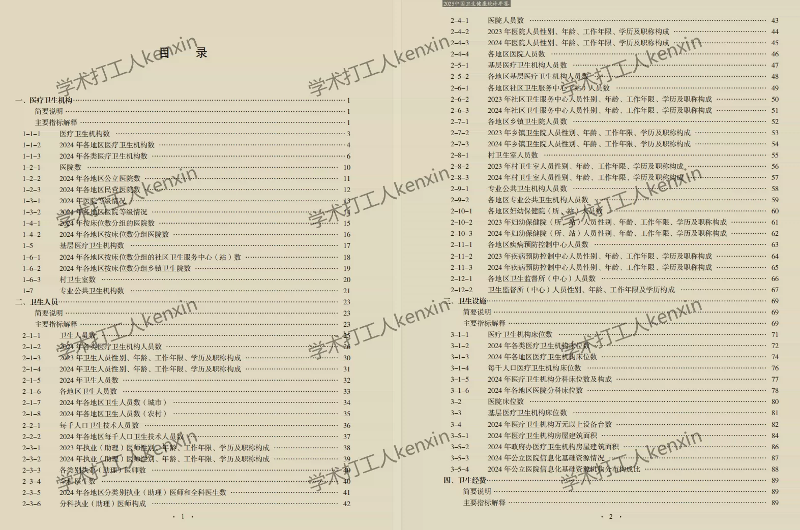
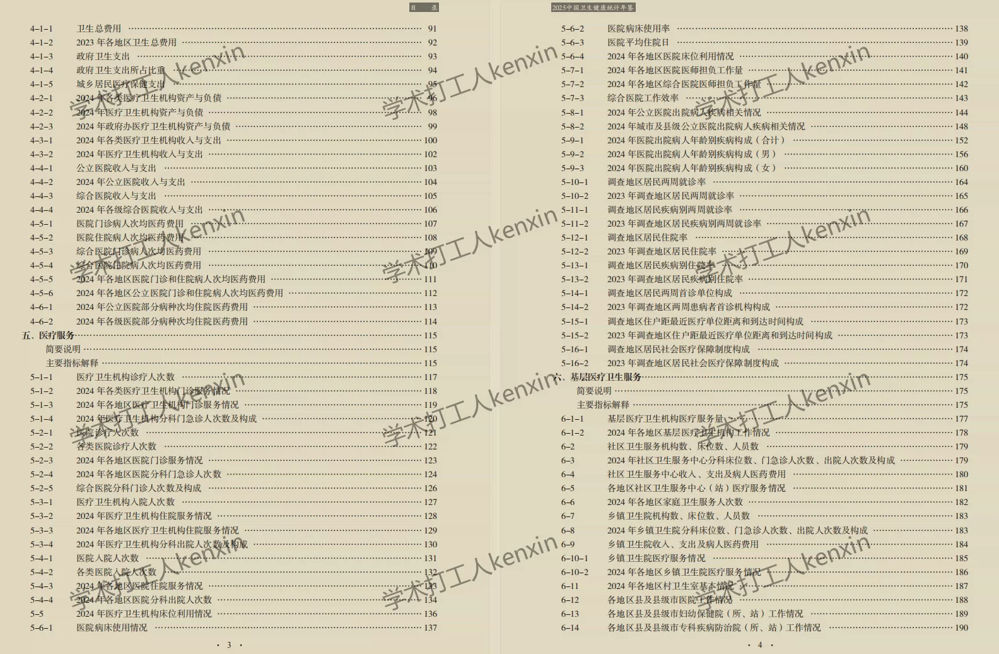
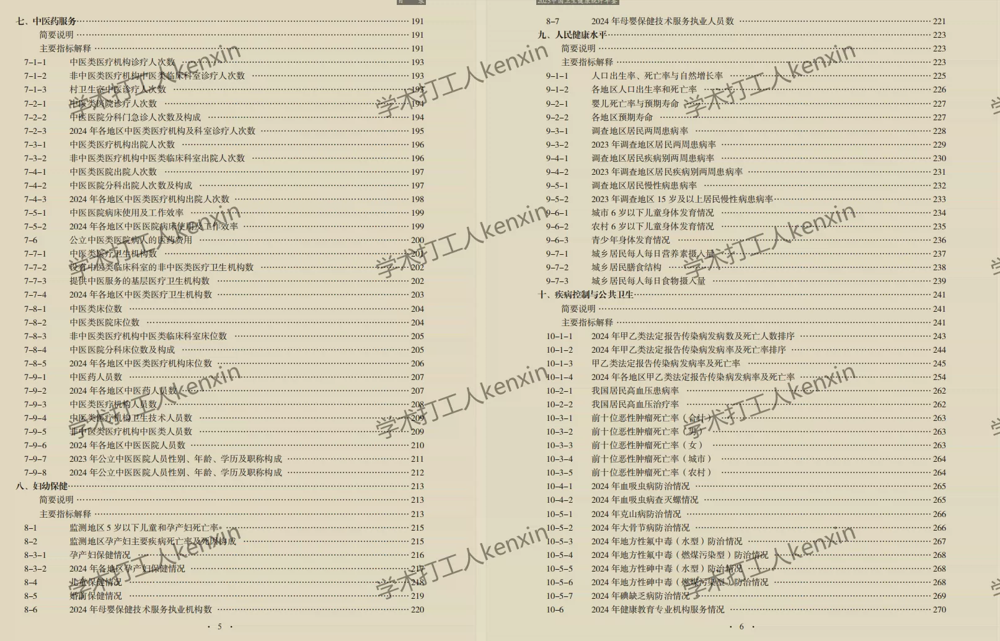
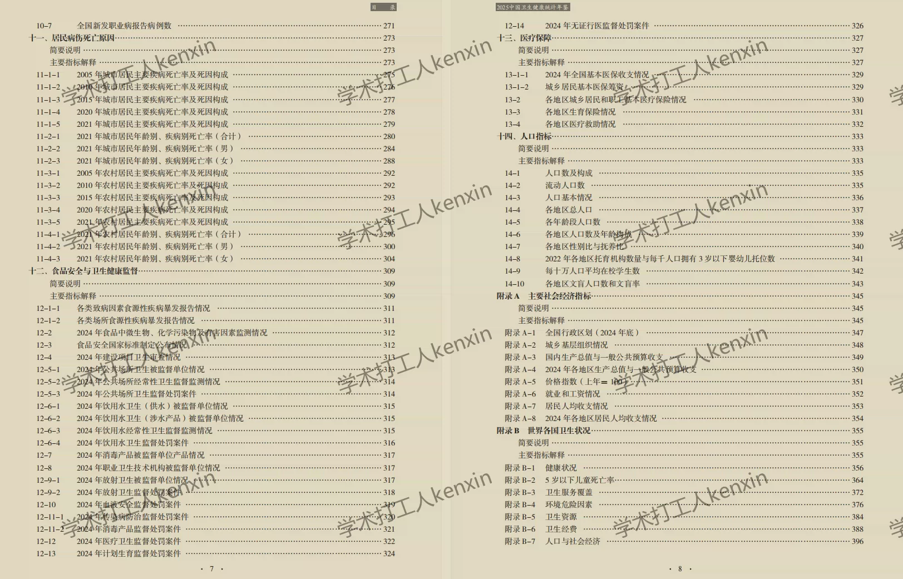

## Body

China Health and Wellness Statistical Yearbook (2003-2025)

Year of Data: The year of the statistical yearbook is from 2003 to 2025 (the data year needs to be subtracted by one).

01. Data Introduction
The "China Health and Wellness Statistical Yearbook", originally known as "China Health and Family Planning Statistical Yearbook".

02. Indicator Details
The directory is displayed in the picture for reference, with the specific content based on the actual publication content. Please refer to it independently, consider purchasing accordingly, and do not help find data. All indicators are here, but after shipping, no return without reason is supported.
The display directory is for 2025, with a lot of content. For some PDF/Excel files, there might be original encryption protection, which can be copied and pasted onto your own sheet for processing. If you have any objections, please do not purchase.

03. Data Content
Format: PDF + some Excel files, only PDF for 2025.
Note: Some PDF/Excel files may have original encryption protection, which can be copied and pasted onto your own sheet for processing. If you have any objections, please do not purchase.

## Images

item_1073058077123

Here is a pay link on Stripe ( https://buy.stripe.com/3cs8yP7sY87d0vu9AB ). Please contact me lonlonago@foxmail.com after funding $89, and I will send you a complete data files , thank you!

